# We're starting a new study-abroad program!

# Here's what you need to know...

## Clemson Summer in Cyprus Program

- **Dates**: June 6 - July 4, 2018
- **Program Fees:** $2700
- **Coursework:** POSC 3610 (International Politics in Crisis), POSC 4760 (Middle East Politics)
- **Where**: University of Nicosia, Cyprus.
- **Housing**: Comfy apartments/flats two blocks from the university

## Why Cyprus?

- **Safest country in the world** for 18-25-year-olds.
- **12% of best beaches in Europe**
- **Sunniest country in Europe**
- **80% of population speaks English.**

## 

```{r, eval=TRUE, echo=FALSE, out.width = "650px", fig.cap="Where you will be staying."}
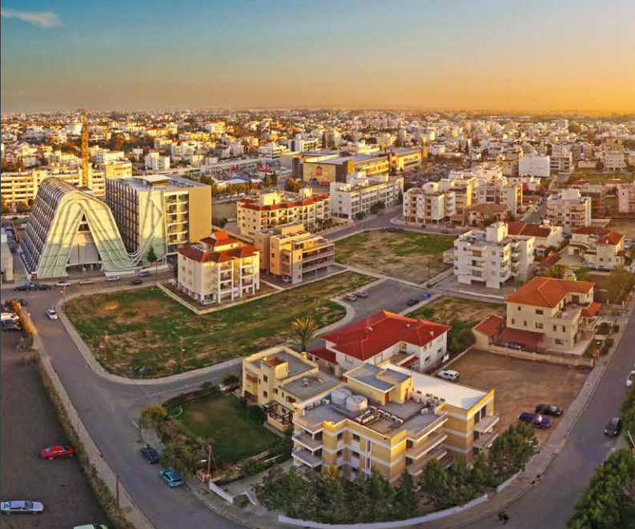
```

## 

```{r, eval=TRUE, echo=FALSE, out.width = "700px", fig.cap="Where you will occasionally be hanging out."}
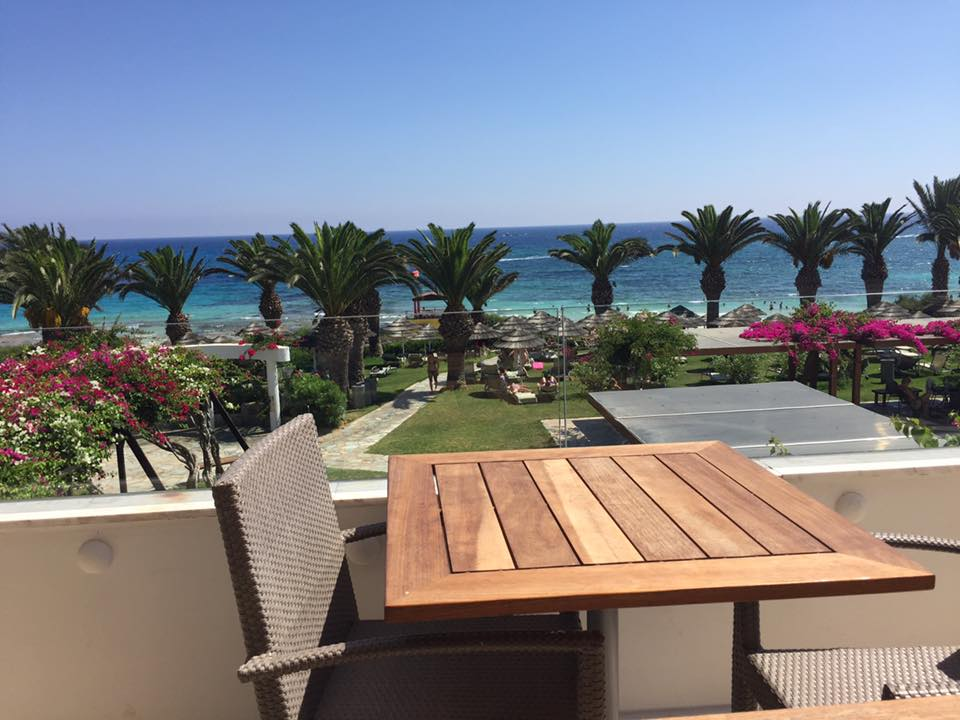
```

## Okay, Why Else?

This program in Cyprus presents a unique opportunity for students interested in international conflict.

- Safest possible place to learn about Middle East politics
- Safest possible place to experience a (frozen) territorial conflict

You'll get to see scars from the worst things humans can do to each other, at absolutely zero risk to yourself.


##

```{r, eval=TRUE, echo=FALSE, out.width = "700px", fig.cap="Legacies of the 1974 conflict are everywhere."}
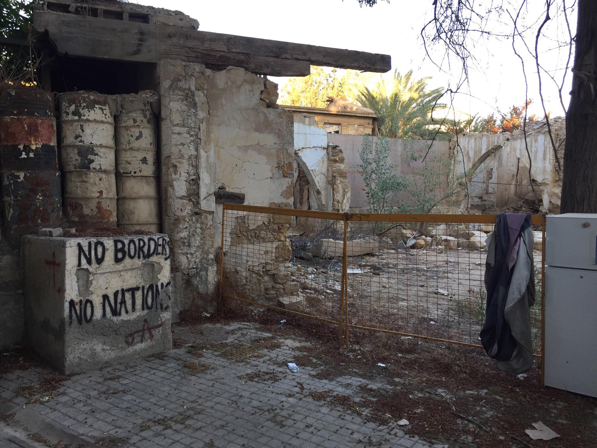
```

##

```{r, eval=TRUE, echo=FALSE, out.width = "700px", fig.cap="The Turkish side still taunts the Greek side."}
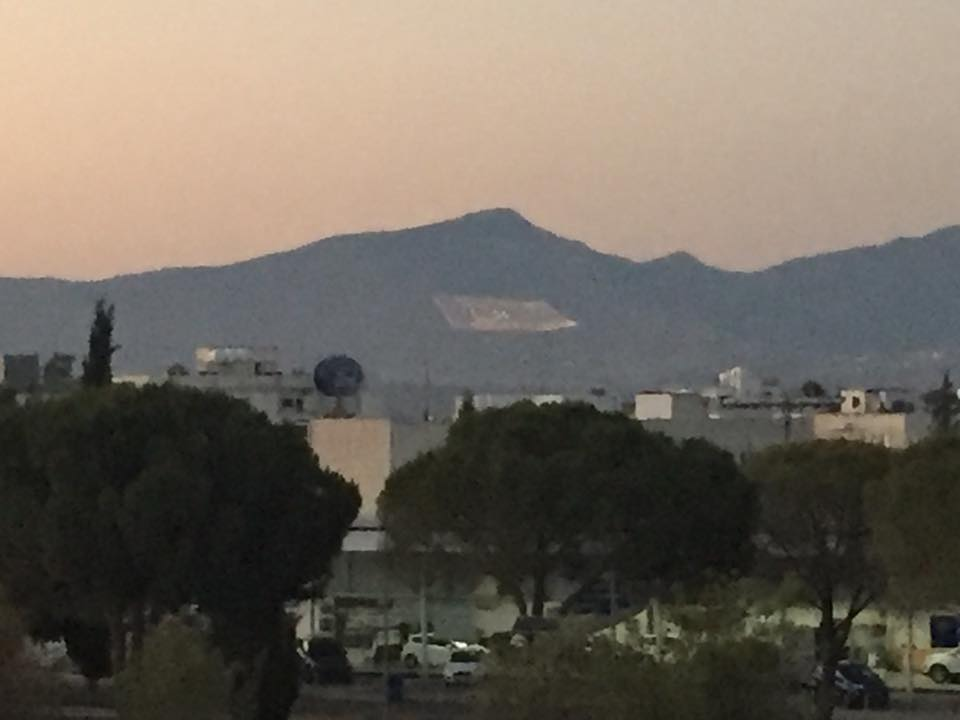
```


##

```{r, eval=TRUE, echo=FALSE, out.width = "700px", fig.cap="Greek peacekeepers are still here."}
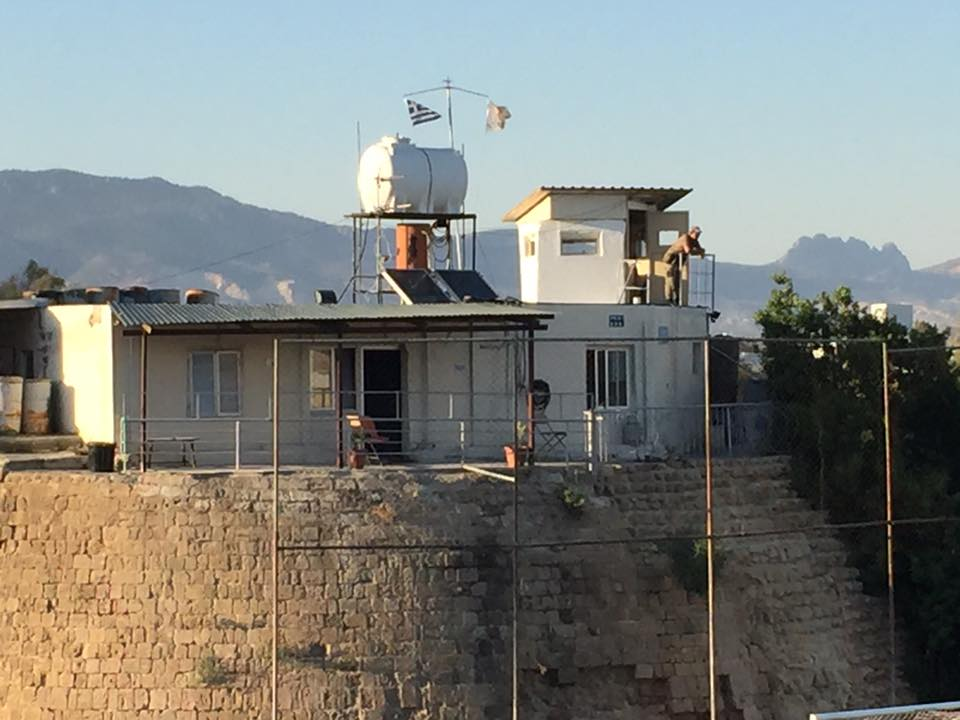
```

##

```{r, eval=TRUE, echo=FALSE, out.width = "700px", fig.cap="Some parts of the city are still trapped in the buffer."}
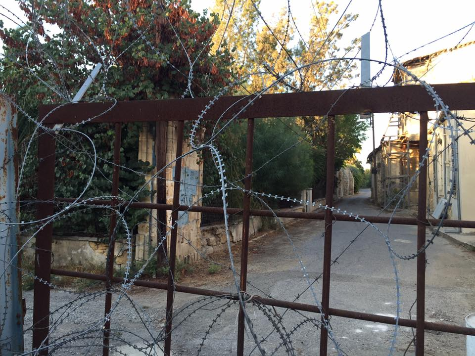
```

##

```{r, eval=TRUE, echo=FALSE, out.width = "700px", fig.cap="Many parts of 'Old Town' still have visible scars/abandoned garrisons."}
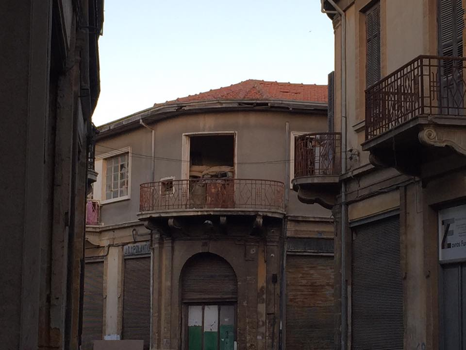
```

##

```{r, eval=TRUE, echo=FALSE, out.width = "700px", fig.cap="The kitty-to-peacekeeper ratio is at least 10/1"}
knitr::include_graphics("../images/cyprus-kitty-2.jpg")
```

# You will seriously see more kitties in the buffer than any sign of threat...

##

```{r, eval=TRUE, echo=FALSE, out.width = "700px", fig.cap="Some of the kitties are quite friendly (oh, and they want food)."}
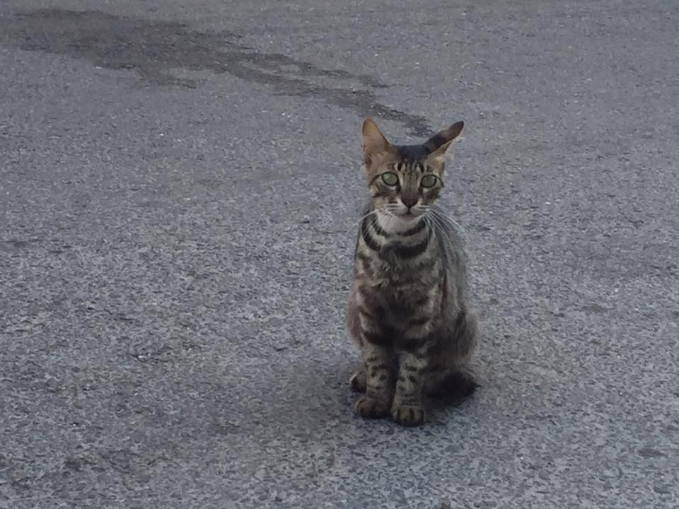
```


# Why else?

## Cyprus is a Unique Country

- Island is effectively the only occupied country in the European Union.
- The British still own about 3% of the island.
- Unique confluence of Muslim/Orthodox Christian influence

##

```{r, eval=TRUE, echo=FALSE, out.width = "700px", fig.cap="Cliff-diving and picture-blue water available on the right."}
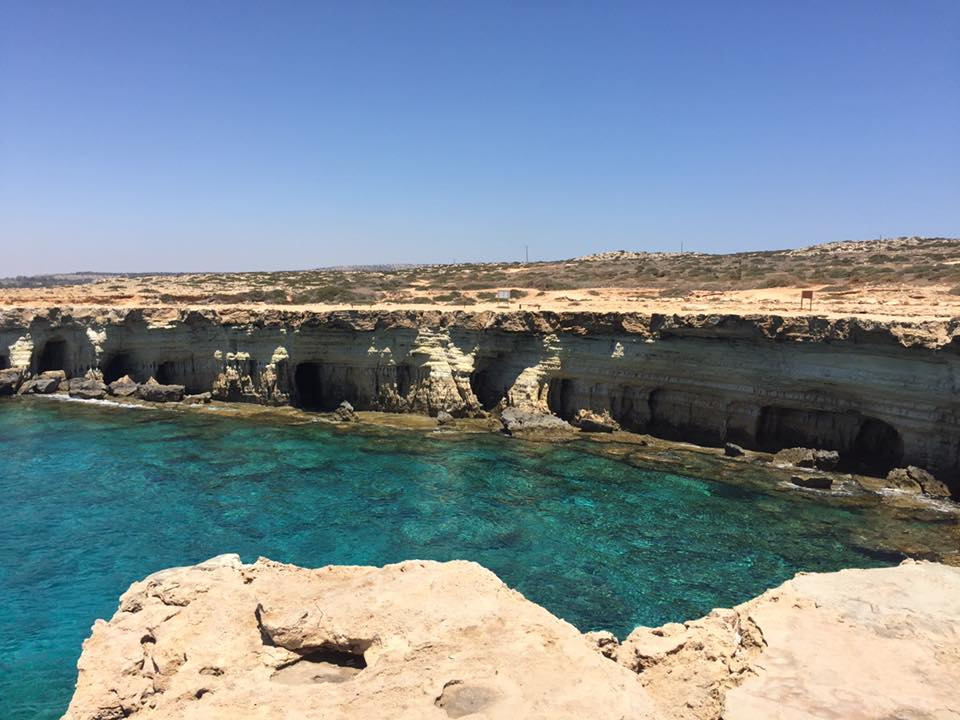
```

## 

```{r, eval=TRUE, echo=FALSE, out.width = "700px", fig.cap="British listening station on the left."}
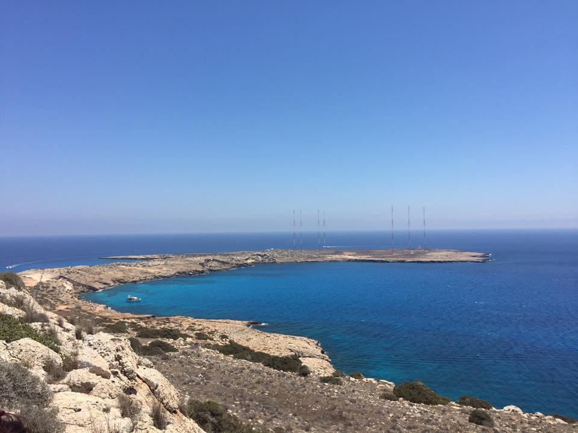
```

## 

```{r, eval=TRUE, echo=FALSE, out.width = "700px", fig.cap="Hala Sultan Tekke, home of the remains of Mohammed's wet nurse."}
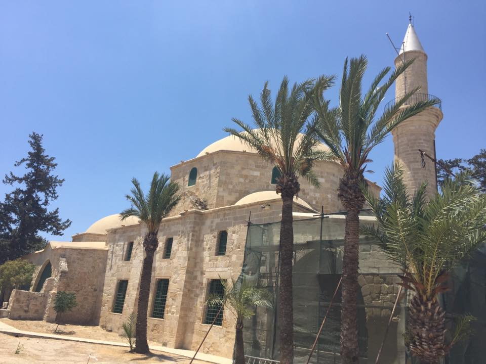
```


## 

```{r, eval=TRUE, echo=FALSE, out.width = "700px", fig.cap="Supposedly contains the remains of Lazarus (yes, that Lazarus)"}
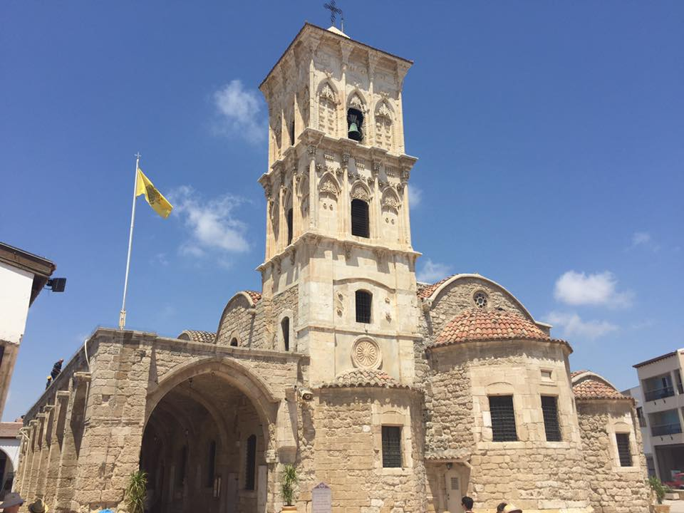
```

## 

```{r, eval=TRUE, echo=FALSE, out.width = "700px", fig.cap="The remains of Lazarus (yes, that Lazarus)"}
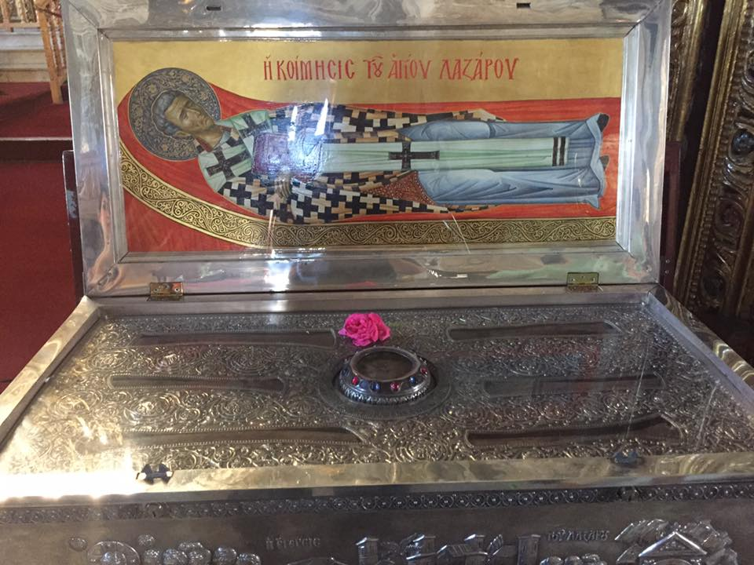
```

# What you'll get from this experience...

## What You'll Get

- Credit for POSC 3610 (International Politics in Crisis) and POSC 4760 (Middle East Politics)
- Multiple excursions all across the island (across both sides)
- Potential lifelong relationship with the University of Nicosia.

    - Many students who go there once come back again.
    
# You should apply!

## Apply!

- We're open to all majors and classes.
- Minimum GPA is a reasonable 2.5.
- [Find us on Terradotta](http://terradotta.app.clemson.edu/index.cfm?FuseAction=Programs.ViewProgram&Program_ID=12338) ("Clemson Summer in Cyprus")
- Email me (svmille@clemson.edu) or Zeynep Taydas (ztaydas@clemson.edu) with any questions.

See website at [svmiller.com/cyprus](http://svmiller.com/cyprus/) for more details as well.

- See the presentation again at [svmiller.com/cyprus/cyprus-presentation.html](http://svmiller.com/cyprus/cyprus-presentation.html)