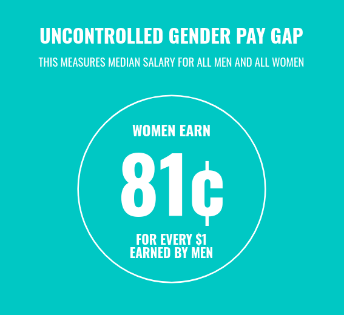
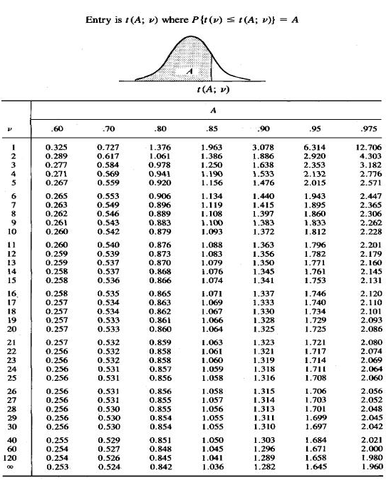
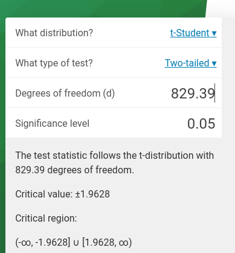

```{r setup, include=FALSE, cache=F, message=F, warning=F, results="hide"}
knitr::opts_chunk$set(cache=TRUE, warning=F, message=F)
knitr::opts_chunk$set(fig.path='figs/', fig.width = 14, fig.height = 9)
knitr::opts_chunk$set(cache.path='cache/')
knitr::opts_chunk$set(
                  fig.process = function(x) {
                      x2 = sub('-\\d+([.][a-z]+)$', '\\1', x)
                      if (file.rename(x, x2)) x2 else x
                      }
                  )
```

```{r loadstuff, include=FALSE}
library(tidyverse)
library(stevedata) # development for now (on Github) because of adding wrkstat to gss_wages
library(stevemisc)
library(ggforce)


tribble(~x0, ~y0, ~r, ~cat,
        0.5, 1, 1, "Political Science Students",
        1.75, 1, 1, "Statistics/Computer Science Students") -> circles


wages10_matched <- readRDS("~/Dropbox/svmiller.github.io/presentations/gender-pay-gap-permutations/data/wages10_matched.rds")
perm_ttests <- readRDS("~/Dropbox/svmiller.github.io/presentations/gender-pay-gap-permutations/data/perm_ttests.rds")

set.seed(8675309)
wages10_matched %>% group_by(gender) %>% slice(51:52, 55, 233, 438) %>%
  ungroup() %>%
  select(gender, realrinc20) -> perm_example

perm_example %>%
  slice(1:5) %>% select(realrinc20) %>% pull() %>% as.integer -> women_salaries

set.seed(8675309)
perm_example %>%
  mutate(perm1 = sample(realrinc20),
         perm2 = sample(realrinc20),
         perm3 = sample(realrinc20),
         perm4 = sample(realrinc20),
         perm5 = sample(realrinc20)) -> dt

dt$gender = cell_spec(dt$gender, background = ifelse(dt$gender == "Female", "#f9c2ee", "#56B4E9"))
dt$realrinc20 = cell_spec(dt$realrinc20, background =ifelse(dt$realrinc20 %in% women_salaries, "#f9c2ee", "#56B4E9"))
dt$perm1 = cell_spec(dt$perm1, background =ifelse(dt$perm1 %in% women_salaries, "#f9c2ee", "#56B4E9"))
dt$perm2 = cell_spec(dt$perm2, background =ifelse(dt$perm2 %in% women_salaries, "#f9c2ee", "#56B4E9"))
dt$perm3 = cell_spec(dt$perm3, background =ifelse(dt$perm3 %in% women_salaries, "#f9c2ee", "#56B4E9"))
dt$perm4 = cell_spec(dt$perm4, background =ifelse(dt$perm4 %in% women_salaries, "#f9c2ee", "#56B4E9"))
dt$perm5 = cell_spec(dt$perm5, background =ifelse(dt$perm5 %in% women_salaries, "#f9c2ee", "#56B4E9"))

broom::tidy(t.test(realrinc20 ~ gender, 
                   data = wages10_matched)) %>%
  pull(estimate) -> income_diff


```

# Introduction
### Goals for Today

1. Learn more about the gender pay gap (in the U.S.)
2. Discuss two paths to statistical inference
3. Tell you a bit more about myself

###

```{r venn-1, echo=F, message=F, warning=F, results="asis"}
ggplot() +
    geom_circle(aes(x0 = x0, y0 = y0, r = r, fill = cat), data = circles, alpha=0.55) +
  theme_steve_web() + scale_fill_brewer(palette="Paired") +
  labs(x = "", y ="", fill = "") +
  # annotate("text", x = .25, y= 1, vjust=.5, 
  #          size = 4, label="- Passionate about politics and improving society\n- Good intuition about social benefits/harms\n - More important than ever (I think!)", family="Open Sans") +
  annotate("text", x = 2.15, y= 1, vjust=.5, 
           size = 4, label="Passionate about programming and analysis\n\nGood intuition about data and methodology\n\nMore useful than ever", family="Open Sans") +
  theme(axis.title.x=element_blank(),
        axis.text.x=element_blank(),
        axis.ticks.x=element_blank(),
        axis.title.y=element_blank(),
        axis.text.y=element_blank(),
        axis.ticks.y=element_blank())
```

###

```{r venn-2, echo=F, message=F, warning=F, results="asis"}
ggplot() +
    geom_circle(aes(x0 = x0, y0 = y0, r = r, fill = cat), data = circles, alpha=0.55) +
  theme_steve_web() + scale_fill_brewer(palette="Paired") +
  labs(x = "", y ="", fill = "") +
  annotate("text", x = .25, y= 1, vjust=.5, 
           size = 4, label="Passionate about politics and improving society\n\nGood intuition about social benefits/harms\n\nMore important than ever (I think!)", family="Open Sans") +
  annotate("text", x = 2.15, y= 1, vjust=.5, 
           size = 4, label="Passionate about programming and analysis\n\nGood intuition about data and methodology\n\nMore useful than ever", family="Open Sans") +
  theme(axis.title.x=element_blank(),
        axis.text.x=element_blank(),
        axis.ticks.x=element_blank(),
        axis.title.y=element_blank(),
        axis.text.y=element_blank(),
        axis.ticks.y=element_blank())
```

###

```{r venn-3, echo=F, message=F, warning=F, results="asis"}
ggplot() +
    geom_circle(aes(x0 = x0, y0 = y0, r = r, fill = cat), data = circles, alpha=0.55) +
  theme_steve_web() + scale_fill_brewer(palette="Paired") +
  labs(x = "", y ="", fill = "") +
  annotate("text", x = .25, y= 1, vjust=.5, 
           size = 4, label="Passionate about politics and improving society\n\nGood intuition about social benefits/harms\n\nMore important than ever (I think!)", family="Open Sans") +
  annotate("text", x = 2.15, y= 1, vjust=.5, 
           size = 4, label="Passionate about programming and analysis\n\nGood intuition about data and methodology\n\nMore useful than ever", family="Open Sans") +
  annotate("text", x = 1.15, y= 1, vjust=.5, 
           size = 4, label="I want to get you here", family="Open Sans") +
  
  theme(axis.title.x=element_blank(),
        axis.text.x=element_blank(),
        axis.ticks.x=element_blank(),
        axis.title.y=element_blank(),
        axis.text.y=element_blank(),
        axis.ticks.y=element_blank())
```

###


<!-- ### What's the Issue? -->

<!-- I see political science instruction at a crossroads. For one: -->

<!-- - The world is moving toward quantification. Think: macroeconomic indicators, polling information, "Big Data." -->

<!-- Understanding statistics may be necessary to being a good democratic citizen. And yet: -->

<!-- - Not everyone is learning statistical literacy. -->
<!-- - Statistical instruction you may get can be awfully dry/wonky. -->
<!-- - Still a level of vilification (e.g. "lies, damned lies, statistics"). -->

<!-- *The Issue*: you're in political science for reasons unrelated to statistics, but you need to learn this anyway. -->

### My Perspective

1. *If you can learn about programming a computer to do something, you have direct access to the deepest, most fundamental ideas in statistics.*
2. Statistics aren't *that* mystifying (but the notation can be unintuitive).

You just need a problem you want to solve. 

- Your computer will solve it for you.

# The Gender Pay Gap
### Motivating Issue: The Gender Pay Gap


### 




### The Data

Let's bring individual-level survey data to bear on this topic.

- *Data:* General Social Survey (2010-2018). *N*: 914.
- *Outcome:* respondent's income (in 2019 USD)
- *Treatment*: respondent's gender (male, female)

Other notes:

- Data subset to those single/never married, with no children, and working full time.
- Data processed/matched to be identical in expectation for age, occupational prestige, college education.
- Raw data available in `gss_wages` in my `{stevedata}` R package.

###

```{r, echo=F, eval=T}
wages10_matched %>%
  group_by(gender) %>%
  summarize(mean_income = mean(realrinc20),
            sd = sd(realrinc20),
            n = n()) %>%
  mutate_if(is.numeric, ~round(.)) %>%
  kbl(., booktabs = T, escape = F, longtable=TRUE,
      col.names = c("Gender", "Average Income", "Std. Dev.", "N"),
      align = c("l","c","c","c","c","c"),
      caption = "Income Averages for Men and Women in the General Social Survey (2010-2018)") %>% 
  row_spec(0, bold=TRUE) %>%
  kable_paper("striped", full_width = F)

```

On average, women earn $10,670 less than men (or 82% of the average man's income).

###

**Skeptic's argument**: A $10,670 difference in income between men and women could have been observed just by random chance.


\bigskip 

**Advocate's argument**: A $10,670 difference in income between men and women is an important difference and is unlikely to have been observed by random chance.

## The STAT 101 (analytical) Method
###

1. The STAT 101 (analytical) method
2. The computational method


### The STAT 101 (Analytical) Method

To do a (two-sample [Welch's]) *t*-test, you'll need to calculate:

- *t*-statistic
- degrees of freedom
- critical value for rejecting skeptic's argument.

### Calculating a *t*-statistic

$$
t \quad = \quad {\; \overline{X}_1 - \overline{X}_2 \; \over \sqrt{ \; {s_1^2 \over N_1} \; + \; {s_2^2 \over N_2} \quad }}\
$$
$$
t \quad = \quad {\; 51086 - 61756 \; \over \sqrt{ \; {55360^2 \over 457} \; + \; {76753^2 \over 457} \quad }}\
$$

$$
t \quad \approx \quad -2.41
$$

###


### Obtaining Degrees of Freedom

$$
\nu \quad  \approx \quad {{\left( \; {s_1^2 \over N_1} \; + \; {s_2^2 \over N_2} \; \right)^2 } \over
 { \quad {s_1^4 \over N_1^2 \nu_1} \; + \; {s_2^4 \over N_2^2 \nu_2 } \quad }}
$$

###


### Obtaining Degrees of Freedom

$$
\nu \quad  \approx \quad {{\left( \; {s_1^2 \over N_1} \; + \; {s_2^2 \over N_2} \; \right)^2 } \over
 { \quad {s_1^4 \over N_1^2 \nu_1} \; + \; {s_2^4 \over N_2^2 \nu_2 } \quad }}
$$


$$
\nu \quad  \approx \quad {{\left( \; {55360^2 \over 457} \; + \; {76753^2 \over 457} \; \right)^2 } \over
 { \quad {55360^4 \over 457^2 456} \; + \; {76753^4 \over 457^2 456 } \quad }}
$$

$$
\nu \quad  \approx \quad 829.39
$$

### The *t*-distribution

$$
\textstyle\frac{\Gamma \left(\frac{\nu+1}{2} \right)} {\sqrt{\nu\pi}\,\Gamma \left(\frac{\nu}{2} \right)} \left(1+\frac{x^2}{\nu} \right)^{-\frac{\nu+1}{2}}\!
$$

where

$$
\Gamma(\alpha) = \int_0^\infty x^{\alpha-1} e^{-x}\, dx
$$

###


###



###



### The STAT 101 (Analytical) Method

Since |-2.41| > 1.9628, we can reject the skeptic's argument.

- The observed test statistic exceedingly rare, far from typical.

But there's got to be a better way.


### In R

For one, make the computer do it for you.

```{r}

broom::tidy(t.test(realrinc20 ~ gender, 
                   data = wages10_matched)) %>%
  # estimate1 = mean for women. estimate2 = mean for men
  rename(diff = estimate,
         t_stat = statistic,
         df = parameter) %>%
  select(diff:df)

```

## The Computational Method
### The Computational Method

A computational alternative, called "permutations", may be more accessible.

- Permutations randomly shuffle the outcome variable and recalculate statistics of interest.

Recall the skeptic's argument: there are no meaningful differences by gender; the difference is due to chance.

- Permutation allows us to regenerate data to test the skeptic's argument.

###

```{r, echo=F, message=F, warning=F, results="asis"}

dt %>% select(gender, realrinc20) %>% 
  kbl(., booktabs = T, escape = F, longtable=TRUE,
      col.names = c("Gender", "Income"),
      align = c("l","c","c","c","c","c"),
      caption = "Ten Select Gender-Income Pairings") %>% 
  row_spec(0, bold=TRUE) %>%
  kable_paper("striped", full_width = F)

```


###

```{r, echo=F, message=F, warning=F, results="asis"}

dt %>% select(gender, realrinc20, perm1) %>% 
  kbl(., booktabs = T, escape = F, longtable=TRUE,
      col.names = c("Gender", "Income", "Perm. 1"),
      align = c("l","c","c","c","c","c"),
      caption = "Ten Select Gender-Income Pairings, with a Permutation") %>% 
  row_spec(0, bold=TRUE) %>%
  kable_paper("striped", full_width = F)

```


###

```{r, echo=F, message=F, warning=F, results="asis"}

dt %>% select(gender, realrinc20, perm1, perm2) %>% 
  kbl(., booktabs = T, escape = F, longtable=TRUE,
      col.names = c("Gender", "Income", "Perm. 1", "Perm. 2"),
      align = c("l","c","c","c","c","c"),
      caption = "Ten Select Gender-Income Pairings, with Two Permutations") %>% 
  row_spec(0, bold=TRUE) %>%
  kable_paper("striped", full_width = F)

```

###

```{r, echo=F, message=F, warning=F, results="asis"}

dt %>% select(gender, realrinc20, perm1, perm2, perm3) %>% 
  kbl(., booktabs = T, escape = F, longtable=TRUE,
      col.names = c("Gender", "Income", "Perm. 1", "Perm. 2", "Perm. 3"),
      align = c("l","c","c","c","c","c"),
      caption = "Ten Select Gender-Income Pairings, with Three Permutations") %>% 
  row_spec(0, bold=TRUE) %>%
  kable_paper("striped", full_width = F)

```

###

```{r, echo=F, message=F, warning=F, results="asis"}

dt %>% select(gender, realrinc20, perm1, perm2, perm3, perm4) %>% 
  kbl(., booktabs = T, escape = F, longtable = TRUE,
      col.names = c("Gender", "Income", "Perm. 1", "Perm. 2", "Perm. 3", "Perm. 4"),
      align = c("l","c","c","c","c","c"),
      caption = "Ten Select Gender-Income Pairings, with Four Permutations") %>% 
  row_spec(0, bold=TRUE) %>%
  kable_paper("striped", full_width = F)

```

###

```{r, echo=F, message=F, warning=F, results="asis"}

dt %>% select(gender, realrinc20, perm1, perm2, perm3, perm4, perm5) %>% 
  kbl(., booktabs = T, escape = F, longtable=TRUE,
      col.names = c("Gender", "Income", "Perm. 1", "Perm. 2", "Perm. 3", "Perm. 4", "Perm. 5"),
      align = c("l","c","c","c","c","c"),
      caption = "Ten Select Gender-Income Pairings, with Five Permutations") %>% 
  row_spec(0, bold=TRUE) %>%
  kable_paper("striped", full_width = F)

```

###

```{r plot-blank-with-actual-diff, echo=F, message=F, warning=F, results="asis"}

perm_ttests %>% 
  ggplot(.,aes(estimate)) + geom_density() +
  theme_steve_web() +
  geom_hline(yintercept = 0) +
  geom_vline(xintercept = income_diff, linetype="dashed") +
  scale_x_continuous(limits = c(-20000, 20000)) +
  scale_y_continuous(limits = c(0, 1)) +
  theme(axis.text.y = element_text(color="#ffffff")) +
  labs(x = "A Distribution of Possible Average Income Differences between Men and Women (in 2019 USD)",
       y = "",
       title = "The Distribution of Possible Average Income Differences Between Men and Women",
       subtitle = "This effectively blank (for now) plot has a single dashed vertical line representing the actual difference (-$10,670).")

```

###

```{r, echo=F, message=F, warning=F, results="asis"}

perm_ttests %>%
  select(perm:estimate2) %>%
  slice(1:1) %>%
  mutate_at(vars("estimate", "estimate1", "estimate2"), ~round(., 2)) %>%
  kbl(., booktabs=TRUE, longtable = TRUE,  linesep = "", 
      align = c("c","c","c","c","c","c"),
      col.names = c("Perm. No.", "Income Diff.", "Mean Income (Women)", "Mean Income (Men)"),
      caption = "Average Income Differences Between Men and Women Across Permutations") %>%
  # kable_styling(full_width = F, 
  #                 latex_options = c("repeat_header", "hold_position")) %>%
  kable_paper("striped", full_width = F) %>%
  row_spec(0, bold=TRUE)

```


###

```{r, echo=F, message=F, warning=F, results="asis"}

perm_ttests %>%
  select(perm:estimate2) %>%
  slice(1:5) %>%
  mutate_at(vars("estimate", "estimate1", "estimate2"), ~round(., 2)) %>%
  kbl(., booktabs=TRUE, longtable = TRUE,  linesep = "", 
      align = c("c","c","c","c","c","c"),
      col.names = c("Perm. No.", "Income Diff.", "Mean Income (Women)", "Mean Income (Men)"),
      caption = "Average Income Differences Between Men and Women Across Permutations") %>%
  # kable_styling(full_width = F, 
  #                 latex_options = c("repeat_header", "hold_position")) %>%
  kable_paper("striped", full_width = F) %>%
  row_spec(0, bold=TRUE)

```


###

```{r plot-blank-with-five-perms, echo=F, message=F, warning=F, results="asis"}

perm_ttests %>% 
  slice(1:5) %>%
  ggplot(.,aes(estimate)) +
  geom_dotplot(dotsize = .75) +
  theme_steve_web() +
  geom_hline(yintercept = 0) +
  geom_vline(xintercept = income_diff, linetype="dashed") +
  scale_x_continuous(limits = c(-20000, 20000), labels=scales::dollar) +
  scale_y_continuous(limits = c(0, 1)) +
  theme(axis.text.y = element_text(color="#ffffff")) +
  labs(x = "A Distribution of Possible Average Income Differences between Men and Women (in 2019 USD)",
       y = "",
       title = "The Distribution of Possible Average Income Differences Between Men and Women",
       subtitle = "This dot plot has five dots for five different permutation means and a vertical line representing the actual difference (-$10,670).")

```

###

```{r, echo=F, message=F, warning=F, results="asis"}

perm_ttests %>%
  select(perm:estimate2) %>%
  slice(1:10) %>%
  mutate_at(vars("estimate", "estimate1", "estimate2"), ~round(., 2)) %>%
  kbl(., booktabs=TRUE, longtable = TRUE,  linesep = "", 
      align = c("c","c","c","c","c","c"),
      col.names = c("Perm. No.", "Income Diff.", "Mean Income (Women)", "Mean Income (Men)"),
      caption = "Average Income Differences Between Men and Women Across Permutations") %>%
  # kable_styling(full_width = F, 
  #                 latex_options = c("repeat_header", "hold_position")) %>%
  kable_paper("striped", full_width = F)

```

###

```{r plot-blank-with-ten-perms, echo=F, message=F, warning=F, results="asis"}

perm_ttests %>% 
  slice(1:10) %>%
  ggplot(.,aes(estimate)) +
  geom_dotplot(dotsize = .75) +
  theme_steve_web() +
  geom_hline(yintercept = 0) +
  geom_vline(xintercept = income_diff, linetype="dashed") +
  scale_x_continuous(limits = c(-20000, 20000), labels=scales::dollar) +
  scale_y_continuous(limits = c(0, 1)) +
  theme(axis.text.y = element_text(color="#ffffff")) +
  labs(x = "A Distribution of Possible Average Income Differences between Men and Women (in 2019 USD)",
       y = "",
       title = "The Distribution of Possible Average Income Differences Between Men and Women",
       subtitle = "This dot plot has 10 dots for 10 different permutation means and a vertical line representing the actual difference (-$10,670).")

```

###

```{r plot-blank-with-25-perms, echo=F, message=F, warning=F, results="asis"}

perm_ttests %>% 
  slice(1:25) %>%
  ggplot(.,aes(estimate)) +
  geom_dotplot(dotsize = .75) +
  theme_steve_web() +
  geom_hline(yintercept = 0) +
  geom_vline(xintercept = income_diff, linetype="dashed") +
  scale_x_continuous(limits = c(-20000, 20000), labels=scales::dollar) +
  scale_y_continuous(limits = c(0, 1)) +
  theme(axis.text.y = element_text(color="#ffffff")) +
  labs(x = "A Distribution of Possible Average Income Differences between Men and Women (in 2019 USD)",
       y = "",
       title = "The Distribution of Possible Average Income Differences Between Men and Women",
       subtitle = "This dot plot has 25 dots for 25 different permutation means and a vertical line representing the actual difference (-$10,670).")

```

###

```{r plot-blank-with-50-perms, echo=F, message=F, warning=F, results="asis"}

perm_ttests %>% 
  slice(1:50) %>%
  ggplot(.,aes(estimate)) +
  geom_dotplot(dotsize = .75) +
  theme_steve_web() +
  geom_hline(yintercept = 0) +
  geom_vline(xintercept = income_diff, linetype="dashed") +
  scale_x_continuous(limits = c(-20000, 20000), labels=scales::dollar) +
  scale_y_continuous(limits = c(0, 1)) +
  theme(axis.text.y = element_text(color="#ffffff")) +
  labs(x = "A Distribution of Possible Average Income Differences between Men and Women (in 2019 USD)",
       y = "",
       title = "The Distribution of Possible Average Income Differences Between Men and Women",
       subtitle = "This dot plot has 50 dots for 50 different permutation means and a vertical line representing the actual difference (-$10,670).")

```

###

```{r plot-blank-with-100-perms, echo=F, message=F, warning=F, results="asis"}

perm_ttests %>% 
  slice(1:100) %>%
  ggplot(.,aes(estimate)) +
  geom_dotplot(dotsize = .75) +
  theme_steve_web() +
  geom_hline(yintercept = 0) +
  geom_vline(xintercept = income_diff, linetype="dashed") +
  scale_x_continuous(limits = c(-20000, 20000), labels=scales::dollar) +
  scale_y_continuous(limits = c(0, 1)) +
  theme(axis.text.y = element_text(color="#ffffff")) +
  labs(x = "A Distribution of Possible Average Income Differences between Men and Women (in 2019 USD)",
       y = "",
       title = "The Distribution of Possible Average Income Differences Between Men and Women",
       subtitle = "This dot plot has 100 dots for 100 different permutation means and a vertical line representing the actual difference (-$10,670).")

```


###

```{r plot-histogram-1000-perms, echo=F, message=F, warning=F, results="asis"}

perm_ttests %>% 
  slice(1:1000) %>% 
  ggplot(.,aes(estimate)) +
  geom_histogram(alpha=0.8, color="black", fill="#619cff") +
  theme_steve_web() +
  geom_hline(yintercept = 0) +
  geom_vline(xintercept = income_diff, linetype="dashed") +
  scale_x_continuous(limits = c(-20000, 20000), labels=scales::dollar) +
  annotate("text", x = -17000, y= 100, vjust=.5, 
           size = 4, label="There are only 1\nof 1,000 permutations\nwhere income differences\nbetween men and women were\nmore extreme than the\nactual difference.", family="Open Sans") +
  # scale_y_continuous(limits = c(0, 1)) +
  # theme(axis.text.y = element_text(color="#ffffff")) +
  labs(x = "A Distribution of Possible Average Income Differences between Men and Women (in 2019 USD)",
       y = "",
       title = "The Distribution of Possible Average Income Differences Between Men and Women",
       subtitle = "This histogram has 1,000 different permutation means and a vertical line representing the actual difference (-$10,670).")

```


###

```{r plot-histogram-10000-perms, echo=F, message=F, warning=F, results="asis"}

perm_ttests %>% 
  slice(1:10000) %>%
  ggplot(.,aes(estimate)) +
  geom_histogram(alpha=0.8, color="black", fill="#619cff") +
  theme_steve_web() +
  geom_hline(yintercept = 0) +
  geom_vline(xintercept = income_diff, linetype="dashed") +
  scale_x_continuous(limits = c(-20000, 20000), labels=scales::dollar) +
  annotate("text", x = -17000, y= 1000, vjust=.5, 
           size = 4, label="There are only 62\nof 10,000 permutations\nwhere income differences\nbetween men and women were\nmore extreme than the\nactual difference.", family="Open Sans") +
  # scale_y_continuous(limits = c(0, 1)) +
  # theme(axis.text.y = element_text(color="#ffffff")) +
  labs(x = "A Distribution of Possible Average Income Differences between Men and Women (in 2019 USD)",
       y = "",
       title = "The Distribution of Possible Average Income Differences Between Men and Women",
       subtitle = "This histogram has 10,000 different permutation means and a vertical line representing the actual difference (-$10,670).")

```

### Inference by Computation/Permutations

Recall the skeptic's argument: there are no meaningful differences by gender; the observed difference is due to chance. We retort:

- We simulated this argument through 10,000 permutations.
- The observed difference is very rare. Only 62 of 10,000 permutations yielded more extreme differences.

We reject the skeptic's argument. The advocate is right to note an important difference.

# Conclusion/Takeaways
### Takeaways

To do statistics in an intuitive way, you'll need the ability to:

1. follow a simple logical argument
2. randomize/shuffle data
3. iterate

You were born with the ability to do the first.

- Any decent programming language will help you with the last two.


###

```{r venn-4, echo=F, message=F, warning=F, results="asis"}
ggplot() +
    geom_circle(aes(x0 = x0, y0 = y0, r = r, fill = cat), data = circles, alpha=0.55) +
  theme_steve_web() + scale_fill_brewer(palette="Paired") +
  labs(x = "", y ="", fill = "") +
  annotate("text", x = .25, y= 1, vjust=.5, 
           size = 4, label="You are starting here", family="Open Sans") +
  # annotate("text", x = 1.15, y= 1, vjust=.5, 
  #          size = 4, label="I want to get you right here.", family="Open Sans") +
  theme(axis.title.x=element_blank(),
        axis.text.x=element_blank(),
        axis.ticks.x=element_blank(),
        axis.title.y=element_blank(),
        axis.text.y=element_blank(),
        axis.ticks.y=element_blank())
```

###

```{r venn-5, echo=F, message=F, warning=F, results="asis"}
ggplot() +
    geom_circle(aes(x0 = x0, y0 = y0, r = r, fill = cat), data = circles, alpha=0.55) +
  theme_steve_web() + scale_fill_brewer(palette="Paired") +
  labs(x = "", y ="", fill = "") +
  annotate("text", x = .25, y= 1, vjust=.5, 
           size = 4, label="You are starting here", family="Open Sans") +
  annotate("text", x = 1.15, y= 1, vjust=.5, 
           size = 4, label="I want to get you here", family="Open Sans") +
  
  theme(axis.title.x=element_blank(),
        axis.text.x=element_blank(),
        axis.ticks.x=element_blank(),
        axis.title.y=element_blank(),
        axis.text.y=element_blank(),
        axis.ticks.y=element_blank())
```

### Recommended Reading

Check my blog! (`svmiller.com/blog`)

- ["Permutations and Inference with an Application to the Gender Pay Gap in the General Social Survey"](http://svmiller.com/blog/2020/10/inference-permutations-gender-pay-gap-general-social-survey/)
- ["What Do We Know About British Attitudes Toward Immigration? A Pedagogical Exercise of Sample Inference and Regression"](http://svmiller.com/blog/2020/03/what-explains-british-attitudes-toward-immigration-a-pedagogical-example/)
- ["The Normal Distribution, Central Limit Theorem, and Inference from a Sample"](http://svmiller.com/blog/2020/03/normal-distribution-central-limit-theorem-inference/)

Check out the presentation as well (`svmiller.com/presentations`).