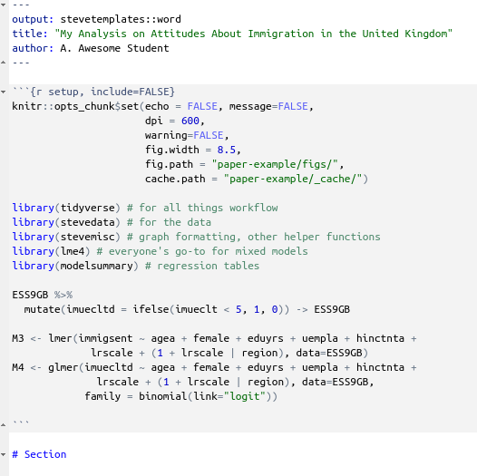
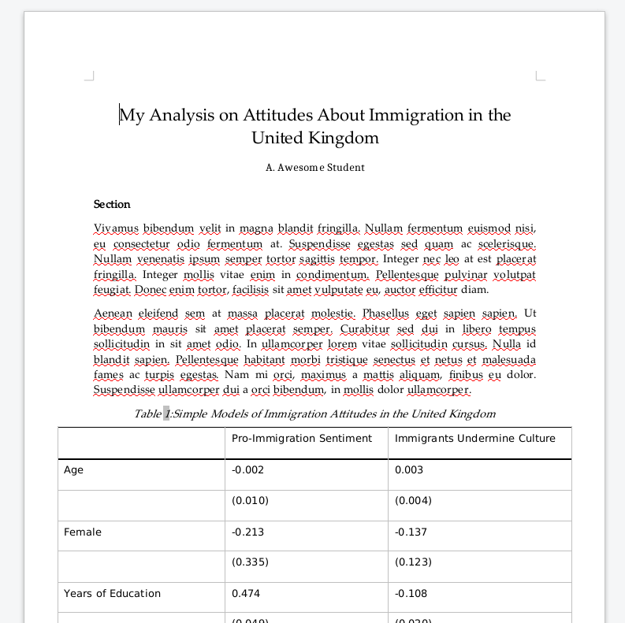

```{r setup, include=FALSE}
knitr::opts_chunk$set(cache=TRUE,
                      message=FALSE, warning=FALSE,
                      fig.path='figs/',
                      cache.path = '_cache/',
                      fig.height = 8.5, fig.width = 14,
                      fig.process = function(x) {
                      x2 = sub('-\\d+([.][a-z]+)$', '\\1', x)
                      if (file.rename(x, x2)) x2 else x
                      })

options(knitr.kable.NA = '')
options("modelsummary_format_numeric_latex" = "plain")
library(tidyverse)
library(stevemisc)
library(stevedata)
library(kableExtra)
library(modelsummary)
library(sf)

# library(cowplot)

eng <- readRDS("eng.rds")
countries <- readRDS("countries.rds")
UK <- readRDS("UK.rds")

library(lme4)

ESS9GB %>%
  mutate(imuecltd = ifelse(imueclt < 5, 1, 0)) -> ESS9GB

```


# Intermediate Quantitative Social Research: A Course Proposal
## Introduction
### Goals for Today

1. Outline a course proposal for an intermediate quant methods class in social science research.
2. Introduce students to `R` (with examples)

## About This Course
### About This Course

This is an intermediate course, assuming a previous course that covered:

- Operationalisation of research questions
- Hypothesis testing
- Basic mathematics for social scientists
- Research designs (e.g. experiments, surveys)
- Descriptive statistics
- OLS regression

### What We Will Cover

1. The `R` programming language
2. Data visualization, descriptive statistics
3. Fitting/interpreting OLS/logistic models.
4. Fitting/interpreting mixed effects models.
5. Model diagnostics/comparisons.
6. Writing a quantitative research paper.

### Why `R`, and How?

Why:

- High demand in private sector.
- `R` is free; everything else costs too much money.
- Rstudio is an excellent IDE (and also free).
- *Great* community support (e.g. StackOverflow, `#rstats` on Twitter).
- Unbeatable for data visualization and document prep (through R Markdown).

How:

- Every lecture comes with lab scripts.
- Everything goes on Github.
- Ample support on my course website/blog.
- You'll learn in part by mimicking.

See more at `http://svmiller.com/presentations`.

## About the Example
### An Example: British Attitudes about Immigration/Immigrants

1. The **data:** European Social Survey (2018) for the UK
2. The **unit of analysis:** the individual respondent in the survey
    - Note: I subset the analysis to just those who were born in the UK.

The **dependent variable** (*DV*) is an additive index [0:30] of three prompts:

- Is it generally bad or good for the UK’s economy that immigrants come to live here? 
    - (`imbgeco`) [0:10; bad:good]
- Is the UK’s cultural life is generally undermined or enriched by immigrants? 
    - (`imueclt`) [0:10; undermined:enriched]
- Is the UK made a worse or a better place to live by immigrants?
    - (`imwbcnt`) [0:10; worse:better]

Higher values = more pro-immigration sentiment.

### Know the Data

The **independent variables** (*IVs*):

- *Age* (in years) [`agea`]
- *Education* (in years of education) [`eduyrs`]
- *Gender* (1 if respondent is a woman) [`female`]
- *Employment status* (1 if respondent is unemployed, but looking for work) [`uempla`]
- *Household income* (in deciles) [`hinctnta`]
- *Ideology* (on 11-point L-R scale) [`lrscale`]

## An Applied Analysis in `R`
### Some Startup `R` Libraries We'll Need

```{r}
#| eval = FALSE
library(tidyverse) # for all things workflow
library(stevedata) # for the data (ESS9GB)
library(stevemisc) # helper functions from my toy package

# Let's use {tidyverse} to create another DV
# This will equal 1 if respondent thinks immigrants 
#  mostly undermine UK culture.

ESS9GB %>%
  mutate(imuecltd = ifelse(imueclt < 5, 1, 0)) -> ESS9GB
```

### What We Can Do in `R`

We can get summary statistics, by region...

\scriptsize
```{r}
ESS9GB %>%
  group_by(region) %>%
  summarize(prop_undermine = mean(imuecltd, na.rm=T),
            mean_immigsent = mean(immigsent, na.rm=T)) %>%
  arrange(-mean_immigsent)
```
\normalsize

### 

```{r}
#| echo = F

ESS9GB %>%
  group_by(region) %>%
  summarize(prop = mean(imuecltd, na.rm=T)) %>%
  mutate(region = str_remove(region, " \\(England\\)"),
         region = ifelse(region == "Yorkshire and the Humber", "Yorkshire and The Humber", region)) %>%
  left_join(UK, ., by=c("Region"="region")) %>%
  ggplot(., aes(fill=prop)) + geom_sf() +
  theme_steve_web() +
  coord_sf(expand = TRUE) +
  scale_fill_continuous(low="#F3E5F5",high="#4A14BC") +
  theme(plot.margin=grid::unit(c(0,0,0,0), "mm"),
        legend.position = "right") +
  labs(fill = "",
       title = "Percentage of Respondents Thinking Immigrants Undermine Culture, by Region",
       subtitle = "The sentiment is highest in North East (40%) and lowest in London (24%) and Scotland (20%).",
       caption = "Data: ?ESS9GB in {stevedata}, by way of the European Social Survey (2018).")
```

### We Can Run a Few Regression Models

```{r}
# Linear model
M1 <- lm(immigsent ~ agea + female + eduyrs + uempla + hinctnta + 
           lrscale, data=ESS9GB)
# Logistic model
M2 <- glm(imuecltd ~ agea + female + eduyrs + uempla + hinctnta + 
            lrscale, data=ESS9GB, family = binomial(link="logit"))
```

### We Can Even Generate Fancy Regression Tables (in `{modelsummary}`)

\scriptsize
```{r reg-table, echo=F, eval=T, fig.width = 14, fig.height = 8.5, warning = F, message = F, results="asis"}

# c("l","D{.}{.}{-1}")
modelsummary(list("Pro-Immigration Sentiment" = M1, "Immigrants Undermine Culture" = M2), output="latex",
             title = "Simple Models of Immigration Attitudes in the United Kingdom",
             gof_omit = "IC|F|Log.|R2$|R2",
             coef_map = c("agea" = "Age",
                          "female" = "Female",
                          "eduyrs" = "Years of Education",
                          "uempla" = "Unemployed",
                          "hinctnta" = "Household Income (Deciles)",
                          "lrscale" = "Ideology (L to R)",
                          "(Intercept)" = "Intercept"),
             align = "lcc",  stars = c('*' = .05), stars_note = TRUE,
             booktabs = T, longtable=TRUE) %>%
    footnote(#general = "\\\\raggedright * p $<$ 0.05",
           general_title = "",
           escape = FALSE) %>%
  row_spec(c(3,4,7,8,11,12), background='#dedede') %>%
  row_spec(0, bold=TRUE)  %>%
  # row_spec(c(1,2,3,4,7,8,11,12), color="#cc0000") %>%
  # row_spec(c(5,6,9,10), color="#00cc00") %>%
  row_spec(c(3,4,7,8,11,12), background='#dedede') %>%
  row_spec(c(5,6,9,10,11,12), bold=TRUE) %>%
  row_spec(0, bold=TRUE) %>%
  column_spec(1, italic = FALSE, color='#000000')

```
\normalsize


### We Can Conveniently Do Some Model Diagnostics

\scriptsize
```{r}
#| eval=F
linloess_plot(M1) # in {stevemisc}
```

\normalsize
```{r}
#| echo=FALSE
linloess_plot(M1, color="black", pch=21) + theme_steve_web() +
  labs(caption = "Data: ?ESS9GB, in {stevedata}.",
       title = "Assessing the Linearity Assumption of the OLS Model",
       subtitle = "Comparing the linear smoother with the LOESS smoother is a useful visual diagnostic of the linearity assumption of OLS. It can also point to outliers/influential observations.")
```

### We Can Also Conveniently Run Mixed Effects Models

\scriptsize
```{r}
#| eval=T, warning=FALSE, message=FALSE
library(lme4) # everyone's go-to for mixed models

M3 <- lmer(immigsent ~ agea + female + eduyrs + uempla + hinctnta + 
             lrscale + (1 + lrscale | region), data=ESS9GB)
M4 <- glmer(imuecltd ~ agea + female + eduyrs + uempla + hinctnta + 
              lrscale + (1 + lrscale | region), data=ESS9GB,
            family = binomial(link="logit"))
#^ will want you to rescale your variables, and we'll talk about why you should do this.
```
\normalsize

###

\scriptsize
```{r}
#| eval=F
show_ranef(M3, "region", reorder=FALSE) # in {stevemisc}
```
\normalsize
```{r}
#| echo=FALSE
show_ranef(M3, "region", reorder=FALSE) + theme_steve_web() +
  labs(caption = "Data: ?ESS9GB, in {stevedata}.",
       title = "A Caterpillar Plot of Random Effects from a Mixed Effects Model",
       subtitle = "These will show which levels of the random effect start higher/lower than the global average and which effects are higher/lower than the global average.")
```

###

```{r}
#| eval = T,
#| echo = F
library(modelr)
ESS9GB %>%
    data_grid(.model = M3, region = unique(region), lrscale = c(0, 10)) -> newdat

merTools::predictInterval(M3, newdat, level = .9, stat = "mean", type="linear.prediction", include.resid.var = FALSE) %>%
  bind_cols(newdat, .) %>%
  mutate(ideocat = ifelse(lrscale == 0, "Most Left", "Most Right")) %>%
    ggplot(.,aes(reorder(region, fit), y=fit, ymax=upr, ymin=lwr, color=ideocat, shape=ideocat)) +
    geom_pointrange(position = position_dodge(width = .3), size=1) +
  scale_color_brewer(palette = "Set1") +
    coord_flip() + theme_steve_web() +
  labs(color = "Ideology", shape = "Ideology",
       y = "Simulated Mean Immigration Sentiment (with 90% Intervals)", x = "",
       title = "Post-Estimation Simulation of Mixed Models Will Tell You More About What Your Effects 'Look Like'",
       subtitle = "They suggest that the most left North East respondents aren't that different from the most right in their sentiment toward immigration. In Scotland: they're very different.",
       caption = "Data: ?ESS9GB, in {stevedata}. Method: Simulation by multivariate normal distribution of coefficients and variance-covariance matrix.")
```


### We Can Also Write Our Reports in R (R Markdown)



This entire presentation was written in R/R Markdown.

### The Ouput from my Word Template



## Conclusion
### Conclusion

This applied course would teach students many real-world skills.

- Statistical concepts (e.g. logistic regression, mixed models)
- Applied methodological skills (all in `R`)
- Reproducibility/workflow techniques (all in `R`, with help from my suite of `R` packages)

It would also teach/do more than I can cover in this presentation.

- e.g. diagnostics, theory, and other good practices

See my website (`http://svmiller.com`) for more.
